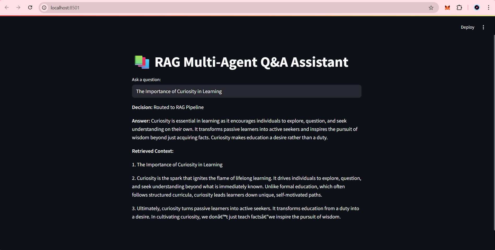

# RAG Multi-Agent Q&A Assistant

This project is a lightweight retrieval-augmented question-answering system that uses an agentic workflow to decide how to handle user queries. It can:
- Retrieve and answer from uploaded knowledge documents (RAG)
- Route to a calculator or dictionary tool when needed

## 🚀 Features
- RAG with FAISS vector DB
- Simple agent routing logic (calculator/dictionary vs retrieval)
- Streamlit UI with decision logging and results

## 🛠️ How to Run
1. Clone the repo
2. Install dependencies:
   ```bash
   pip install -r requirements.txt
   ```
3. Set your OpenAI API key:
   ```bash
   export OPENAI_API_KEY=your-key-here
   ```
4. Run the app:
   ```bash
   streamlit run app.py
   ```

## Sample Data
Place your `.txt` documents inside the `data/` folder.

## 🧱 Technologies Used
- LangChain
- FAISS
- Streamlit
- OpenAI (or HuggingFace)

## 📸 Screenshots
